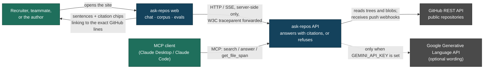
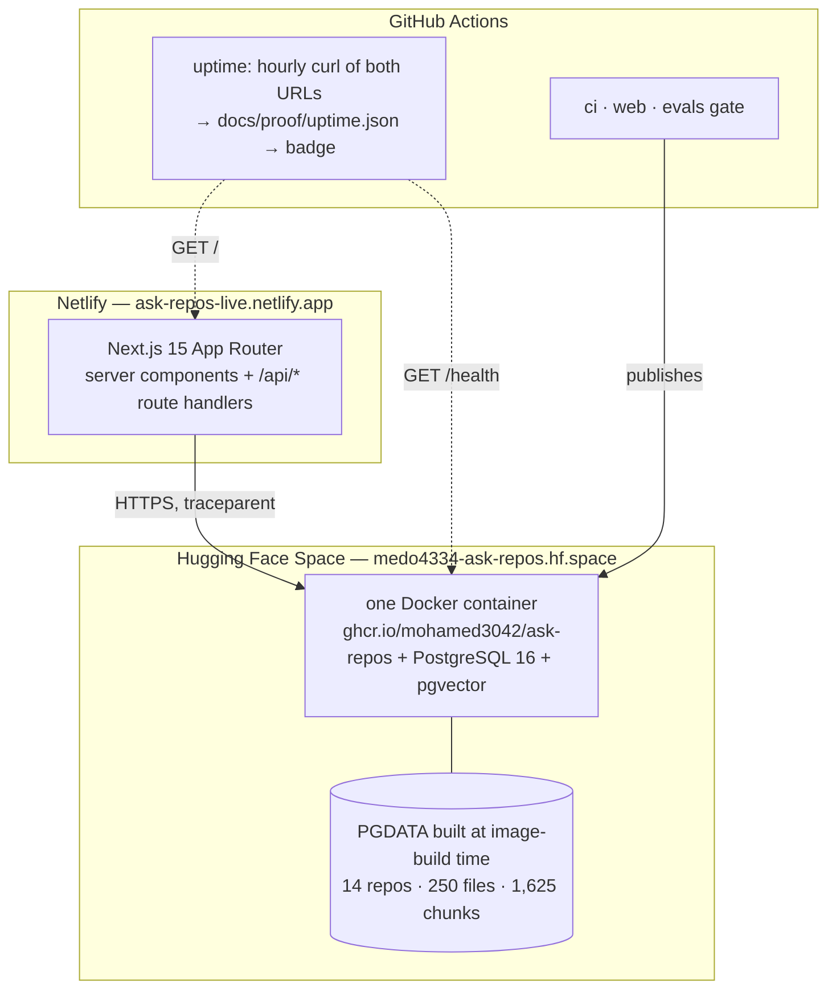
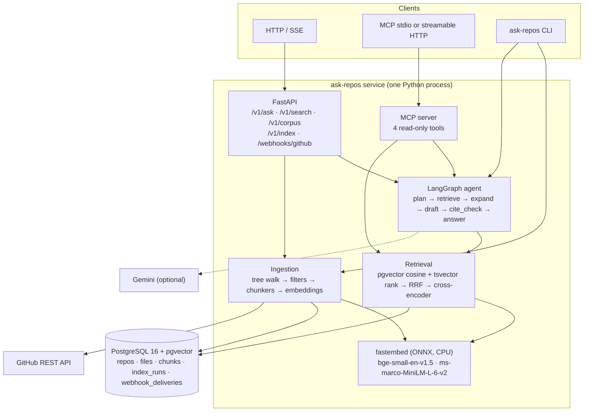
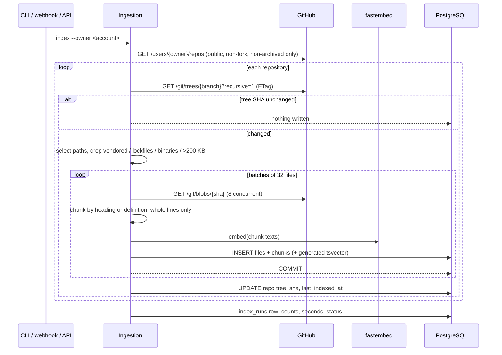
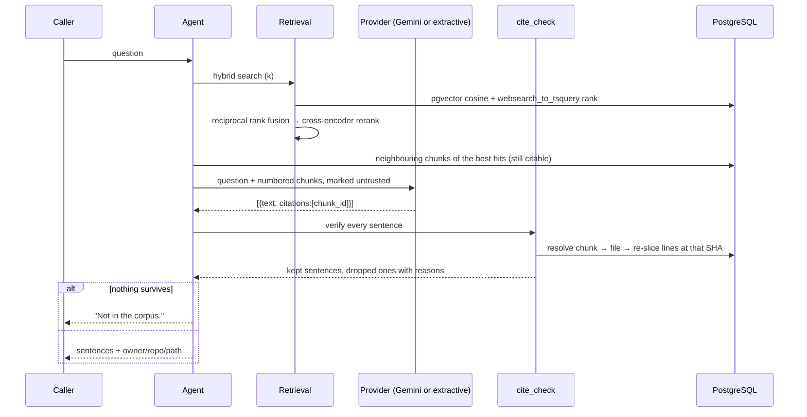

# Architecture

`ask-repos` turns a GitHub account's public repositories into a corpus that can be
questioned, and refuses to say anything it cannot anchor to file lines it has stored and
re-verified.

## C4 level 1 — context



The browser never talks to the API. Every request it makes goes to a Next.js route handler
on the same origin, which calls the API from the server — so the API address and any key
stay out of the page (ADR 0007).

## C4 level 1 — where it actually runs



The Space is **read-only**: `POST /v1/index`, the push webhook and *approving* an
agent-requested re-index all answer 403, and `/v1/ask*` is rate limited. The corpus is a
fixed snapshot baked into the image, which is why it needs no attached database and no
first-boot indexing (ADR 0008).

Without a Gemini key the dotted edge simply does not exist: the service still indexes,
searches, answers extractively, serves MCP and runs its whole eval suite.

## C4 level 2 — containers



## Data flow — one index run



A file whose blob SHA has not moved is never re-fetched, re-chunked or re-embedded, so a
re-index over an unchanged account writes zero chunks. That is asserted in
`tests/test_pipeline.py::test_reindex_of_an_unchanged_account_writes_nothing`.

## Data flow — one question



## Data flow — one question, from the browser

```mermaid
sequenceDiagram
    participant B as Browser
    participant N as Next route handler (/api/ask)
    participant S as ask-repos API
    participant J as Jaeger

    B->>N: POST {question}
    N->>N: start a span; build `traceparent`
    N->>S: POST /v1/ask/stream  (traceparent: 00-<trace>-<span>-01)
    S->>S: server span joins the caller's trace
    S-->>N: text/event-stream: one `sentence` per verified sentence, then `done`
    N-->>B: the same byte stream, plus `x-trace-id`
    B->>B: render each sentence with its citation chips
    N-->>J: ask-repos-web spans
    S-->>J: ask-repos spans, parented to the route handler's
```

Measured on 2026-09-06 with the Compose tracing profile: trace
`9b182dc49461bbfe689e62cfc329fa7f`, `ask-repos-web` span `6637b33f0ec7a0f5`
(*executing api route (app) /api/ask/route*) is the parent of `ask-repos` span
`67a34151bd4380a7` (*POST /v1/ask/stream*) — 18 spans, 2 services, depth 4
([`proof/trace-ui-to-api.png`](proof/trace-ui-to-api.png)). The assertion is in
`web/e2e/tracing.spec.ts`; the picture is taken by the same test that makes the claim.

## Trust boundaries

| boundary | what crosses it | how it is controlled |
|---|---|---|
| GitHub → ingestion | repository text | Only public, non-fork, non-archived repositories; size, path and binary filters; text is stored as **data**, never executed or interpreted |
| corpus → model prompt | retrieved chunks | The system prompt declares the context untrusted; the red-team evals in `evals/injection/` prove an instruction inside a file does not become an instruction to the service |
| model → user | drafted sentences | `cite_check` re-resolves every citation against the database and drops unsupported sentences; the model cannot introduce a claim the corpus does not carry |
| caller → corpus (write) | index runs | `POST /v1/index` needs an API key; the webhook needs a valid HMAC signature and a fresh delivery id; the agent's own `reindex` tool needs a human approval (ADR 0003) |
| browser → route handler | the question | Same-origin; the handler validates length and shape, and is the only place that knows `ASK_REPOS_API_URL` / `ASK_REPOS_API_KEY` (`server-only` makes importing it from a client component a build error) |
| hosted demo → corpus | nothing | `ASK_REPOS_READONLY=1` refuses every write with a reason, and a fixed-window limiter caps `/v1/ask*` and `/v1/search`. `/health` and `/v1/corpus` are never throttled so an uptime probe costs a visitor nothing |
| caller → corpus (read) | search and answers | Public by design — everything indexed is already public on GitHub. Private repositories are refused twice: once in the listing filter, once in the pipeline (`PrivateRepoRefused`) |

## What is not here

* No authentication for read routes. The corpus is public data; adding auth would imply a
  privacy property the service does not have.
* No cross-process checkpointer, so an approval thread does not survive a restart.
* No incremental vector index maintenance beyond what pgvector's HNSW does on insert.
* No shared rate-limit state. The limiter is per-container and per-process — honest for a
  one-instance demo, wrong for anything horizontally scaled.
* No authentication on the UI. It is a public demo of public data.
* The hosted corpus is frozen at build time, so the Space cannot follow the repositories;
  the push webhook that would is documented, tested and disabled there on purpose.
