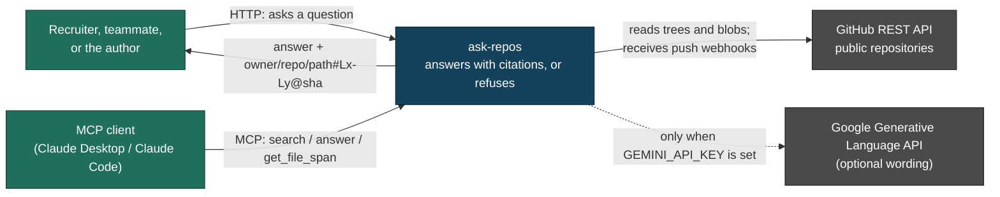
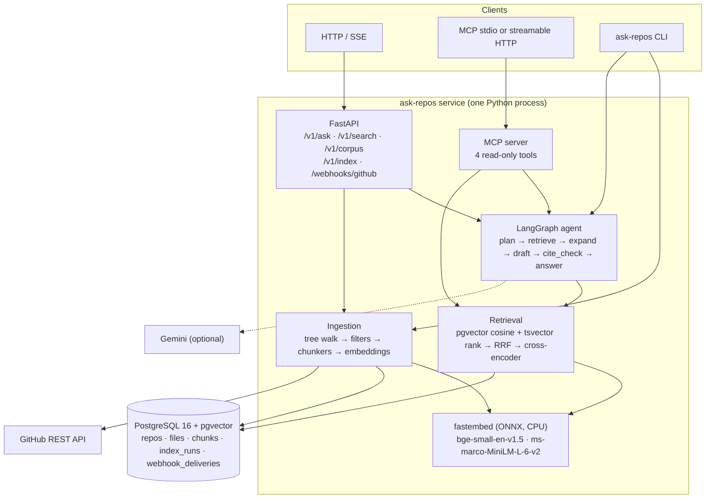
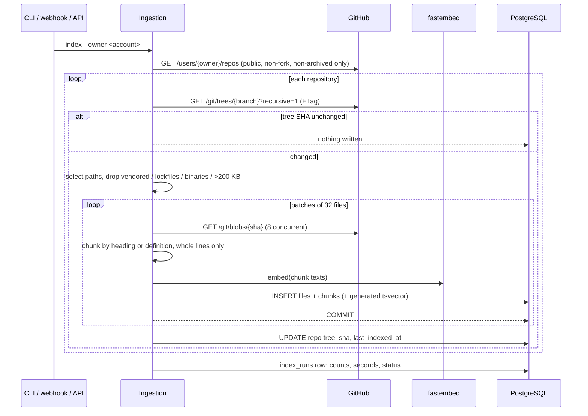
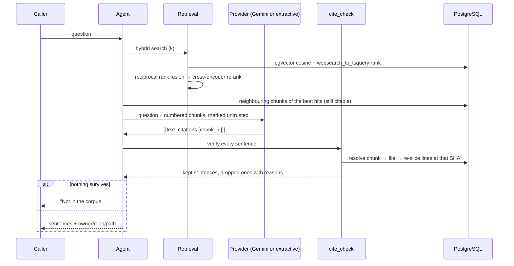

# Architecture

`ask-repos` turns a GitHub account's public repositories into a corpus that can be
questioned, and refuses to say anything it cannot anchor to file lines it has stored and
re-verified.

## C4 level 1 — context

Without a Gemini key the dotted edge simply does not exist: the service still indexes,
searches, answers extractively, serves MCP and runs its whole eval suite.

## C4 level 2 — containers

## Data flow — one index run

A file whose blob SHA has not moved is never re-fetched, re-chunked or re-embedded, so a
re-index over an unchanged account writes zero chunks. That is asserted in
`tests/test_pipeline.py::test_reindex_of_an_unchanged_account_writes_nothing`.

## Data flow — one question

## Trust boundaries

| boundary | what crosses it | how it is controlled |
|---|---|---|
| GitHub → ingestion | repository text | Only public, non-fork, non-archived repositories; size, path and binary filters; text is stored as **data**, never executed or interpreted |
| corpus → model prompt | retrieved chunks | The system prompt declares the context untrusted; the red-team evals in `evals/injection/` prove an instruction inside a file does not become an instruction to the service |
| model → user | drafted sentences | `cite_check` re-resolves every citation against the database and drops unsupported sentences; the model cannot introduce a claim the corpus does not carry |
| caller → corpus (write) | index runs | `POST /v1/index` needs an API key; the webhook needs a valid HMAC signature and a fresh delivery id; the agent's own `reindex` tool needs a human approval (ADR 0003) |
| caller → corpus (read) | search and answers | Public by design — everything indexed is already public on GitHub. Private repositories are refused twice: once in the listing filter, once in the pipeline (`PrivateRepoRefused`) |

## What is not here

* No authentication for read routes. The corpus is public data; adding auth would imply a
  privacy property the service does not have.
* No cross-process checkpointer, so an approval thread does not survive a restart.
* No incremental vector index maintenance beyond what pgvector's HNSW does on insert.
* No UI. That is the next lane (`gaps-ask-repos-ui`); the CORS allowlist is already
  configurable for it via `ASK_REPOS_CORS_ORIGINS`.
