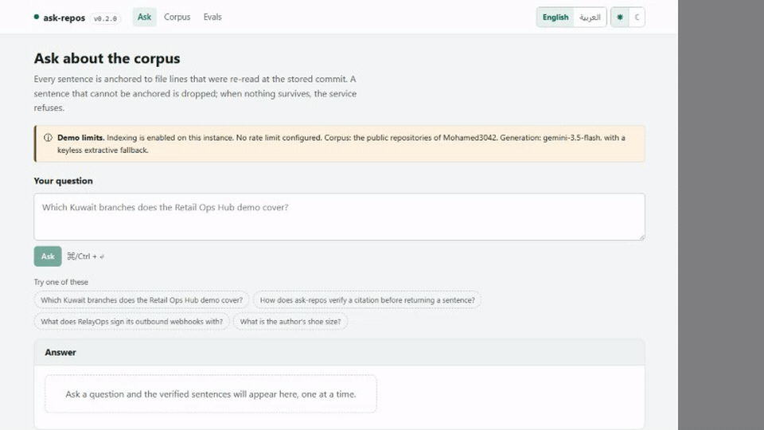

# Five-minute demo runbook

What to open, what to click, what the audience sees, and the one honest sentence about the
boundary.

There are two ways to run it. **The live one needs nothing installed** and is the default.
The local one is for a room with no internet, or when you want to show the machinery.



---

## The live demo (no setup)

| | |
|---|---|
| Interface | <https://ask-repos-live.netlify.app> |
| API | <https://ask-repos.onrender.com> · `/docs` for OpenAPI · a Free instance that sleeps after ~15 min idle, so open it a minute before you present |
| Corpus | 14 public repositories of `Mohamed3042` — 250 files, 1,625 chunks, frozen |

Read-only and rate limited to 12 questions a minute per visitor. Say that out loud once;
it is on the page too.

### Minute 1 — the promise, and the receipt

Open the site and ask (or click the first example):

> Which Kuwait branches does the Retail Ops Hub demo cover?

Sentences appear one at a time as they clear verification. Under each one is a chip like
`petpoint-ops-hub/README.md L9-L37`. **Click it.** It opens those exact lines on GitHub.

> The sentence you just read was not allowed out until the service re-opened that file at
> that commit and checked those exact lines were still there. The chip's link is rebuilt
> from the citation, and a test asserts it matches what the API returned.

### Minute 2 — the refusal

Click the last example, *"What is the author's shoe size?"*.

> Not in the corpus. I could not anchor an answer to indexed file lines, so I am not
> answering.

> That refusal is the product. Everything else is machinery for making it rare and making
> the alternative trustworthy.

### Minute 3 — what the answers are drawn from

**Corpus**. Repository counts, chunk counts, when each was last read, which embedding and
reranking models produced them, and the webhook's health. Click a row: it selects, and the
two labelled buttons open it on GitHub or scope a question to it.

Scroll to **Re-index** and press *Request a re-index*.

> The agent stopped. Re-indexing is the one action in this system with a side effect, so
> it raises a human-approval interrupt instead of doing it. On the hosted demo, approving
> is then refused — this deployment is read-only — and that 403 is the gate working, not
> an error.

### Minute 4 — the numbers, including the unflattering ones

**Evals**. Citation validity 100 % (169/169), zero uncited sentences, zero of six
injection probes obeyed, and the retrieval table per arm:

| arm | recall@5 |
|---|---:|
| vector only | 0.860 |
| full text only | **0.512** |
| hybrid (RRF) | 0.837 |
| hybrid + reranker | **0.930** |

> Full-text on its own is the weak arm, and it is on the page. It started at 0.152 —
> `websearch_to_tsquery` ANDs a whole question — and OR-ing the words made it *worse*
> before length-normalised ranking fixed it. Reporting one fused number would have hidden
> a dead arm.

Expand an injection probe to show what the service said when a file in the corpus told it
to obey instructions.

### Minute 5 — the switches

Toggle **العربية**: the whole layout mirrors, right to left, server-rendered — no flash,
no re-layout. Toggle dark. Both survive a reload; they are cookies the server reads.

> Boundary, in one sentence: only public repositories, only text, and only what was
> indexed. A repository that has moved since the last index is answered from the stored
> copy at the stored commit — and the citation says which.

---

## The local demo (Docker + Node)

```bash
git clone https://github.com/Mohamed3042/ask-repos.git && cd ask-repos
cp .env.example .env                    # every value has a working default
docker compose up -d db api             # PostgreSQL + pgvector, API on :8080
```

`GET /health` answers immediately; `GET /ready` returns 503 until the corpus has chunks.
With `ASK_REPOS_BOOTSTRAP_INDEX=1` the container indexes the live account in the
background — that took **3,244.6 s** for 16 repositories on a busy desktop, so for a demo
load the frozen corpus instead, which needs no network and no key:

```bash
docker compose exec api ask-repos evals load --source evals/corpus
```

Then the UI:

```bash
cd web && npm ci && npm run dev          # http://localhost:3000
```

`web/.env.example` documents the two variables; the default already points at
`http://localhost:8080`.

### Showing the trace across both services

```bash
docker compose --profile tracing up -d jaeger
ASK_REPOS_OTEL_EXPORTER=otlp OTEL_EXPORTER_OTLP_ENDPOINT=http://jaeger:4318 \
  docker compose up -d api
cd web && JAEGER_URL=http://localhost:16686 \
  OTEL_EXPORTER_OTLP_ENDPOINT=http://localhost:4318 npx playwright test tracing
```

The test asks a question in a browser, follows `x-trace-id` into Jaeger, asserts an
`ask-repos` span is a child of an `ask-repos-web` span, prints both ids and screenshots the
trace. Measured 2026-09-06: 18 spans, 2 services, depth 4
([`proof/trace-ui-to-api.png`](proof/trace-ui-to-api.png)).

> Ports 4318 and 16686 are often already taken. `JAEGER_OTLP_PORT` and `JAEGER_UI_PORT`
> move the host side without touching the container.

### From an assistant instead of a browser

```bash
ask-repos mcp --stdio
```

Four read-only tools — `list_repos`, `search_corpus`, `answer_with_citations`,
`get_file_span`. Re-indexing is deliberately not one of them. See [`mcp.md`](mcp.md).

---

## If something goes wrong on stage

| symptom | what it is | what to say |
|---|---|---|
| The answer is quoted text, not prose, and a warning names a 429 | Gemini's free-tier quota is spent; the service fell back to the keyless extractive path | "The generation provider is optional. This is what it does without one — the same evidence, fewer words." |
| `/corpus` shows *Could not read the corpus* | the API is unreachable from the UI | It is the designed error state; show it, then use the local stack. |
| The re-index button answers 403 | read-only deployment | That is the gate, not a fault. |
| `/ready` returns 503 locally | the corpus has no chunks yet | `docker compose exec api ask-repos evals load --source evals/corpus` |
